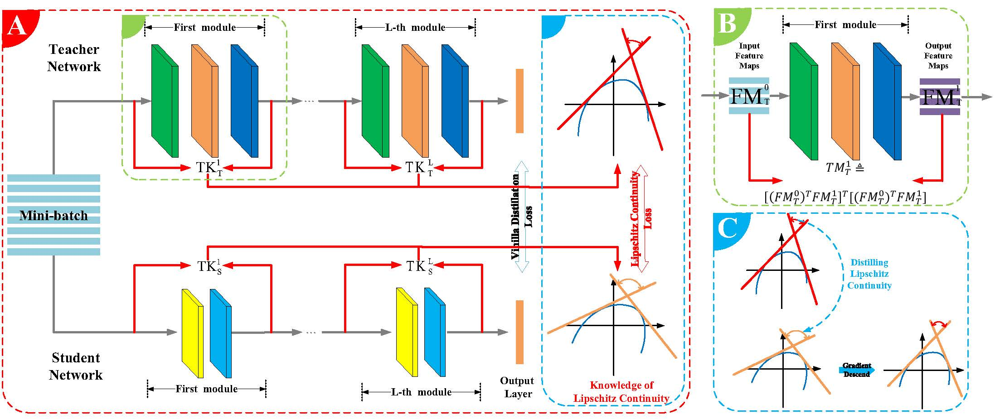

# LONDON: Lipschitz Continuity Guided Knowledge Distillation
This is the official pytorch implementation for paper: Lipschitz Continuity Guided Knowledge Distillation, which is accepted by ICCV2021([paper](https://arxiv.org/abs/2108.12905)).    



## Quick Start
First, download our repo:
```bash
git clone https://github.com/42Shawn/LONDON.git
cd LONDON/ImageNet
```
Then, run our repo:
```bash
python train_with_distillation_london.py 
```

## Citation
Please cite our paper if you find it useful in your research:

```
@inproceedings{shang2021london,    
  title={Lipschitz Continuity Guided Knowledge Distillation},    
  author={Shang, Yuzhang and Duan, Bin and Zong, Ziliang and Nie, Liqiang and Yan, Yan},    
  booktitle={ICCV},    
  year={2021}    
}
```
